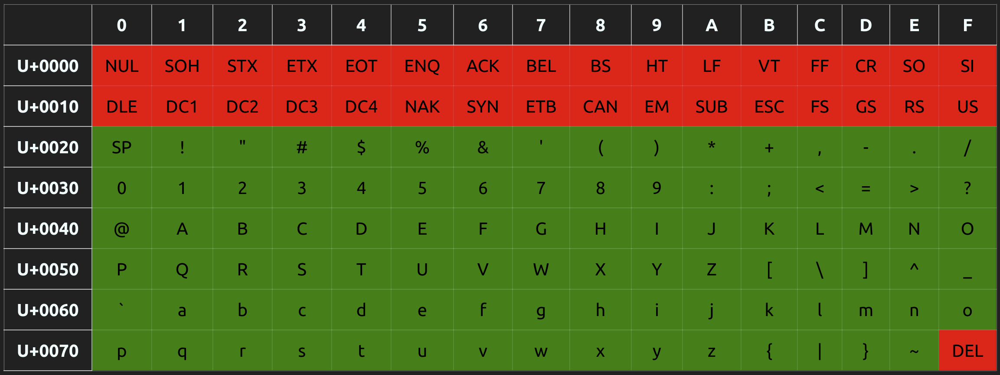

# IBMF (Integrated Bitmap Font) Font manipulation tools

(Updated 2021.10.16)

- [x] Some issues with glyph raster size corrected.
- [x] Issues with accent extraction corrected.
- [x] Issue when accents are larger than the character.
- [x] Accents position on Italic characters adjusted.
- [x] Fonts re-generated.
- [x] Augmented set of accented characters. See tables below.


This is a suite of tools to generate and manipulate IBMF fonts.

IBMF fonts are created from the need of having better-looking fonts to use on low-resolution monochrome displays (i.e. displays with a DPI lower than 250). This is an opiniatre font format that is based on the METAFONT available toolkit that generates bitmap fonts. The format integrates multiple font point sizes in the same file. It is loosely based on the PK font format that uses run-length encoding of bitmaps to compress the information in a small characters bundle. The IBMF font format is described in the file `doc/IBMF Format.md`.

The following tools are provided:

- A font generator
- A one-file C++ class to access fonts
- A simple example application
- A tool to dump all font bitmap content to a terminal screen

All C/C++ tools are compiled through the PlatformIO application. 

## 1. Font Generator

The `fonts\gener.sh` is used to generate IBMF fonts by:

1) Generating PK fonts from the METAFONT foundry.
2) Extracting the information from the PK fonts to generate IBMFsubfonts.
3) Packing the information in IBMF fonts through PlatformIO built program named `generator`. The resulting fonts are located in the `fonts` folder.

The targetted fonts suites are:

  - Computer Modern Roman Serif
  - Computer Modern Sans-Serif
  - Typewriter

Each IBMF font contains 8, 9, 10, 12, 14, 17, and 24 points bitmaps.
Each Computer Modern font suit produces Regular, Bold, Italic, and Bold-Italic fonts. Only Regular and Italic are available for the Typewriter fonts.

To generate the METAFONT files through the `gener.sh` script, you need to have `TeXlive` installed, as well as the `sauter` package from the `sauter.zip` file available on CTAN. The `TeXlive` is usually available through packages for your operating system.

The `sauter` package must be installed manually. A copy of it is supplied in the main folder (file `sauter.zip`). The location to install it on Linux is usually `/usr/share/texlive/texmf-dist/fonts/source/public/`. After that, you must run the `mktexlsr` application from a shell to integrate it to the METAFONT search path.

The `fonts/gener.sh` content can be updated to take into account other DPI than the one generated. As it was built for some devices named `inkplate6`, `inkplate10` and `inkplate6plus`, there are files with extension `.mf` for those devices in the `fonts/` folder that can be renamed and modified to accommodate your needs. You can then modify the content of `fonts/gener.sh` accordingly. 

## 2. C++ access class

The C++ class (`ibmf_font.hpp`) that allows for the extraction of characters is provided, allowing the retrieval of glyphs from the various point bitmaps size available in the font. Please look at the `latin_example` program on how to use it.

The `IBMFFont` class currently support the follwing UNICODE characters:

- Uncolored characters are supported
- Characters colored in RED will return a space character (no bitmap) as they are not supported
- Characters colored in GREEN will return the equivalent ASCII character
- Characters in YELLOW are supported only throught the Computer Modern Typewriter font

### 2.1 Table 1 - ASCII codes:



### 2.2 Table 2 - Latin-1 codes:


### 2.3 Table 3 - Latin-A codes:


## 3. Simple Example Application

The `latin_example` application shows how simple is the access to the IBMFFont class. It accepts a character to show on screen as a serie of spaces and Xs in all available font sizes. It must be used in a terminal shell, the current folder must be the project's main folder. You can change the defaults in the main application source code.

In the code, the `IBMFFont` class must be instantiated. Before retrieving a glyph through the `get_glyph()` method, you must set the font size through the `set_font_size()` method. That method will choose the size from the available one in the `.ibmf` font file, taking the one that is equal or lower to the requested size. The size is in points (There is 72.27 points in an inch).

The application uses a simple method names `to_unicode()` to translate the received parameter from the UTF-8 format to UNICODE. That means that your shell must be using UTF-8 to encode non-ascii characters. This is usually the case on Linux.

Here is an example of use (the first part of the output is shown):

```
~/Dev/ibmf$ .pio/build/latin_example/program À
Glyph Char Code: 41
  Point Size: 8
  Metrics: [16, 21] 
  Position: [1, -20]
  Advance: 18
  Pitch: 2
  Bitmap available: Yes
+----------------+
|     XX         |
|     XXX        |
|      XXX       |
|        XX      |
|                |
|       XX       |
|       XX       |
|       XX       |
|      XXXX      |
|      XXXX      |
|     XXXXXX     |
|     X  XXX     |
|     X  XXX     |
|    X    XXX    |
|    X    XXX    |
|    X    XXX    |
|   XXXXXXXXXX   |
|   X      XXX   |
|   X      XXX   |
|  XX      XXXX  |
|XXXXX    XXXXXXX|
+----------------+

Glyph Char Code: 41
  Point Size: 9
  Metrics: [17, 24] 
  Position: [1, -23]
  Advance: 20
  Pitch: 3
  Bitmap available: Yes
+-----------------+
|      XXX        |
|      XXX        |
|      XXXX       |
|        XX       |
|         X       |
|                 |
|        X        |
|       XXX       |
|       XXX       |
|       XXX       |
|      XXXXX      |
|      X XXX      |
|      X XXX      |
|     X   XXX     |
|     X   XXX     |
|     X   XXX     |
|    X     XXX    |
|    X     XXX    |
|    XXXXXXXXX    |
|   X       XXX   |
|   X       XXX   |
|   X       XXX   |
|  XX       XXXX  |
|XXXXXX   XXXXXXXX|
+-----------------+
```

## 4. Font dump tool

This tool will show on screen in a terminal shell the complete list of supported characters. It uses spaces and Xs to show the characters. As many character as possible to fit on a matrix having a width of 200 columns will be put on each *line*.

There is no parameters to give to the tool. You can modify it's content to, for example, select another font or another point size. Only characters that generate bitmaps are output.

Here is the beginning of the output:


