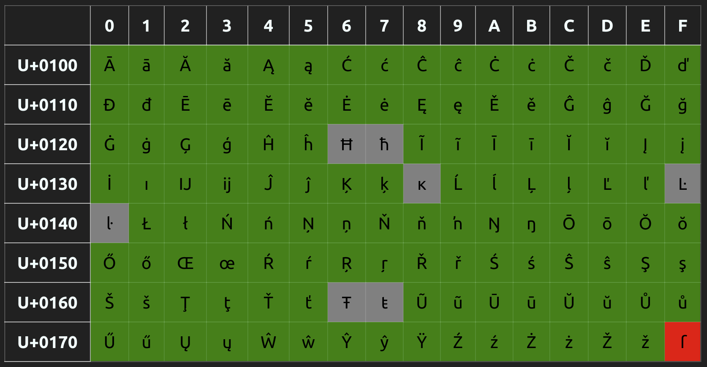

# IBMF (Integrated Bitmap Font) Font manipulation tools

(Updated 2021.12.08)

The format has been modified to use the European Computer Modern suite of fonts instead of the Computer Modern suite of fonts, to allow for better coverage of accented European characters.

- [x] Corrected some issues with glyph raster size.
- [x] Corrected issues with accent extraction.
- [x] Corrected issue when accents are larger than the character.
- [x] Accents position on Italic characters still need some adjustments.
- [x] Fonts re-generated.
- [x] Augmented set of accented characters. See tables below.
- [x] Support for up to 254 glyphs in fonts (174 glyphs currently used).
- [x] Support for EC typeset (European Computer Modern) instead of Computer Modern.
- [x] The `sauter` package is no longer required.
- [x] Font offsets in preamble are now 4 bytes instead of 2 (IBMF fonts are often larger than 64K).
- [ ] Documentation need some update.


This is a suite of tools to generate and manipulate IBMF fonts.

IBMF fonts are created from the need of having better-looking fonts to use on low-resolution monochrome displays (i.e. displays with a DPI lower than 250). This is an opiniatre font format that is based on the METAFONT available toolkit that generates bitmap fonts. The format integrates multiple font point sizes in the same file. It is loosely based on the PK font format that uses run-length encoding of bitmaps to compress the information in a small characters bundle. The IBMF font format is described in the file `doc/IBMF Format.md`.

The following tools are provided:

- A font generator
- A one-file C++ class to access fonts
- A simple example application
- A tool to dump all font bitmap content to a terminal screen

All C/C++ tools are compiled through the PlatformIO application. 

## 1. Font Generator

The `fonts\ec_gener.sh` is used to generate IBMF fonts by:

1) Generating PK fonts from the METAFONT foundry.
2) Extracting the information from the PK fonts to generate IBMF subfonts.
3) Packing the information in IBMF fonts through PlatformIO built program named `generator`. The resulting fonts are located in the `fonts` folder.

The targetted font typefaces are:

  - European Computer Modern Roman Serif
  - European Computer Modern Sans-Serif
  - European Computer Modern Typewriter

Each IBMF font contains 8, 9, 10, 12, 14, 17, and 24 points bitmaps.
Each European Computer Modern font suite produces Regular, Bold, Italic, and Bold-Italic fonts. Only Regular and Italic are available for the Typewriter fonts.

To generate the METAFONT files through the `ec_gener.sh` script, you need to have `TeXlive` installed. The `TeXlive` is usually available through packages for your operating system.

The `fonts/ec_gener.sh` content can be updated to take into account other DPI than the one generated. As it was built for some devices named `inkplate-6`, `inkplate-10`, and `inkplate-6plus`, there are files with extension `.mf` for those devices in the `fonts/` folder that can be renamed and modified to accommodate your needs. You can then modify the content of `fonts/ec_gener.sh` accordingly. 

## 2. C++ access class

The C++ class (`ibmf_font.hpp`) that allows for the extraction of characters is provided, allowing the retrieval of glyphs from the various point bitmaps size available in the font. Please look at the `latin_example` program on how to use it.

The `IBMFFont` class currently supports a large portion of the ASCII, Latin-1, and Latin-A UNICODE characters as shown in the tables below. 

- Characters colored in GREEN are supported
- Characters colored in RED will return a space character (no bitmap) as they are not supported
- Characters colored in GRAY will return the equivalent ASCII character

### 2.1 Table 1 - ASCII codes:


### 2.2 Table 2 - Latin-1 codes:


### 2.3 Table 3 - Latin-A codes:



### 2.4 Other supported characters:

The following characters are also supported:

| Unicode | Description          |
|:-------:|----------------------|
| U+02BB  | reverse apostrophe
| U+02BC  | apostrophe
| U+02C6  | circumflex
| U+02DA  | ring
| U+02DC  | tilde ~
| U+2013  | endash (Not available with CM Typewriter)
| U+2014  | emdash (Not available with CM Typewriter)
| U+2018  | quote left
| U+2019  | quote right
| U+201A  | comma like ,
| U+201C  | quoted left "
| U+201D  | quoted right
| U+2032  | minute '
| U+2033  | second "
| U+2044  | fraction /
| U+20AC  | euro


## 3. Simple Example Application

The `latin_example` application shows how simple is the access to the IBMFFont class. It accepts a character to show on screen as a series of spaces and Xs in all available font sizes. It must be used in a terminal shell, the current folder must be the project's main folder. You can change the defaults in the main application source code.

In the code, the `IBMFFont` class must be instantiated. Before retrieving a glyph through the `get_glyph()` method, you must set the font size through the `set_font_size()` method. That method will choose the size from the available one in the `.ibmf` font file, taking the one that is equal or lower to the requested size. The size is in points (There are 72.27 points in an inch).

The application uses a simple method named `to_unicode()` to translate the received parameter from the UTF-8 format to UNICODE. That means that your shell must be using UTF-8 to encode non-ASCII characters. This is usually the case on Linux.

Here is an example of use (the first part of the output is shown):

```
~/Dev/ibmf$ .pio/build/latin_example/program À
Glyph Char Code: 41
  Point Size: 8
  Metrics: [16, 21] 
  Position: [1, -20]
  Advance: 18
  Pitch: 2
  Bitmap available: Yes
+----------------+
|     XX         |
|     XXX        |
|      XXX       |
|        XX      |
|                |
|       XX       |
|       XX       |
|       XX       |
|      XXXX      |
|      XXXX      |
|     XXXXXX     |
|     X  XXX     |
|     X  XXX     |
|    X    XXX    |
|    X    XXX    |
|    X    XXX    |
|   XXXXXXXXXX   |
|   X      XXX   |
|   X      XXX   |
|  XX      XXXX  |
|XXXXX    XXXXXXX|
+----------------+

Glyph Char Code: 41
  Point Size: 9
  Metrics: [17, 24] 
  Position: [1, -23]
  Advance: 20
  Pitch: 3
  Bitmap available: Yes
+-----------------+
|      XXX        |
|      XXX        |
|      XXXX       |
|        XX       |
|         X       |
|                 |
|        X        |
|       XXX       |
|       XXX       |
|       XXX       |
|      XXXXX      |
|      X XXX      |
|      X XXX      |
|     X   XXX     |
|     X   XXX     |
|     X   XXX     |
|    X     XXX    |
|    X     XXX    |
|    XXXXXXXXX    |
|   X       XXX   |
|   X       XXX   |
|   X       XXX   |
|  XX       XXXX  |
|XXXXXX   XXXXXXXX|
+-----------------+
```

## 4. Font dump tool

This tool will show on screen in a terminal shell the complete list of supported characters. It uses spaces and Xs to show the characters. As many characters as possible to fit on a matrix having a width of 200 columns will be put on each *line*.

There are no parameters to give to the tool. You can modify its content to, for example, select another font or another point size. Only characters that generate bitmaps are output.

Here is the beginning of the output:


